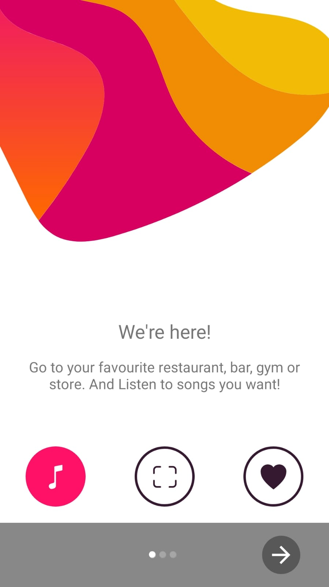
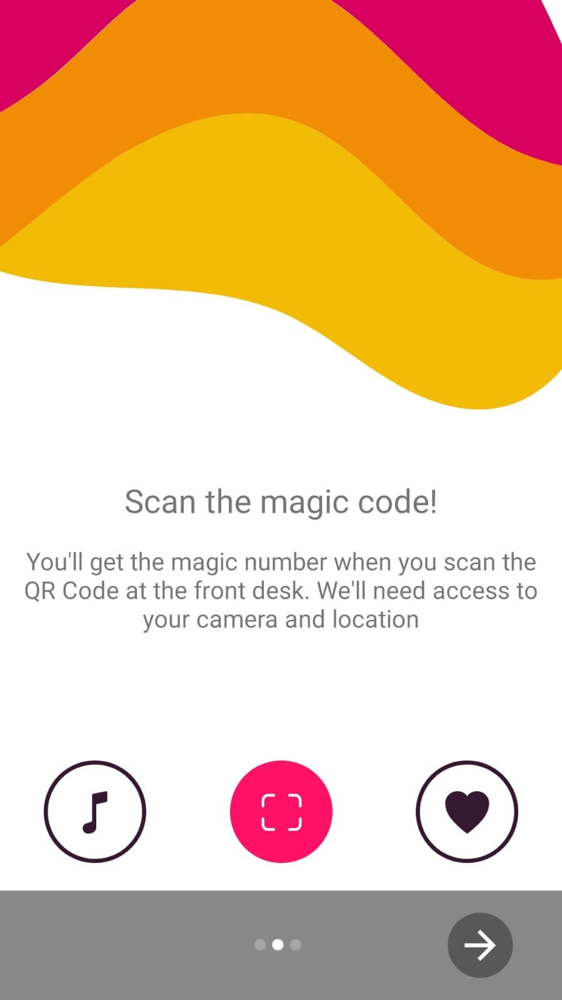
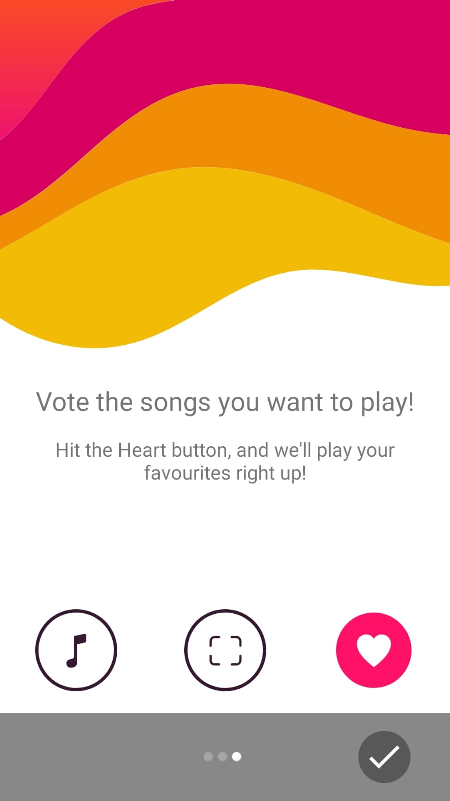
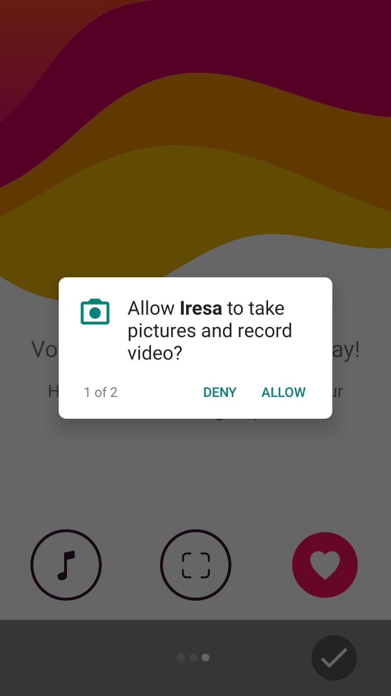
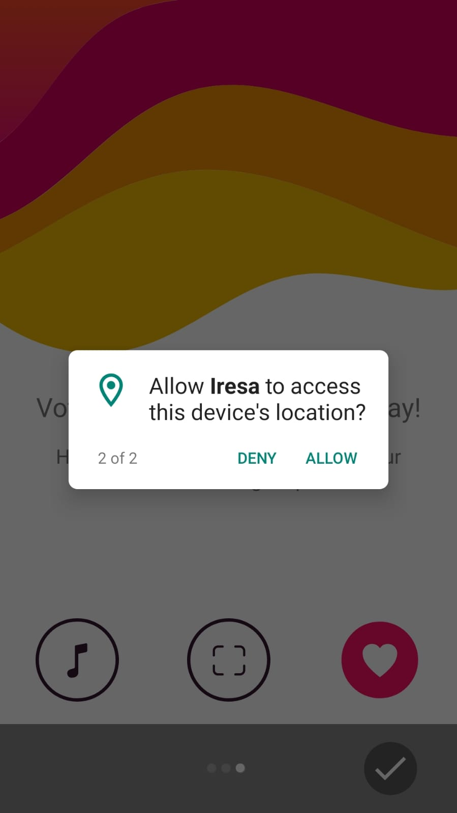
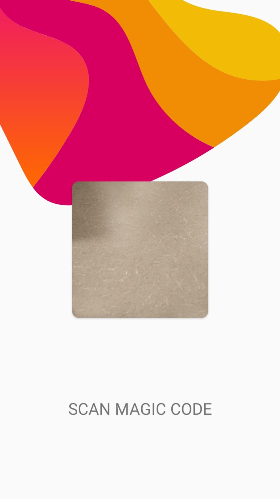
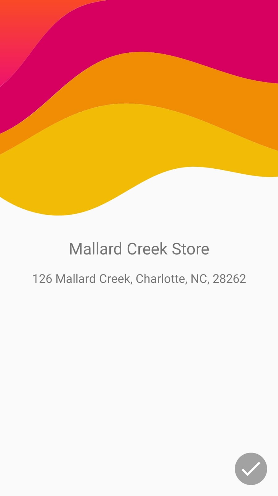
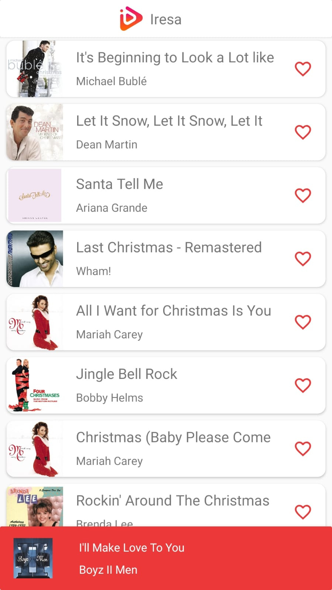

# Iresa Android

Iresa offers a nice, convenient solution to help business owners customize their music’s playlist by allowing their own customers to vote for their favorite songs to play during their visits.

Iresa Android is one of the two components of Iresa's Playlist Management. This component is an Android native mobile application that allows users to vote for their favorite songs suggested by stations' owners.

## Features

- Login to specific station using QR Code scanning
- View a list of songs suggested by the station's owner
- Vote for one or more songs
- Update UI in real time whenever a new list of songs is available to vote

